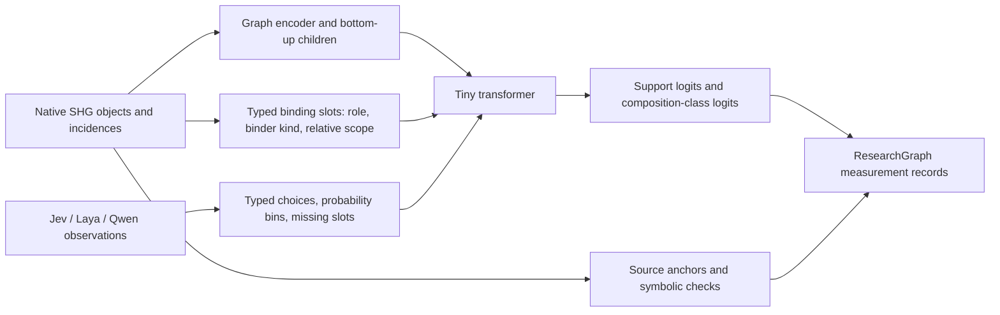

# SHG and typed-observer student

The input is a native object/incidence graph plus typed observer fields. Source
text, hashes, admission status and adjudication outcomes remain in provenance;
they are not parsed from JSON text or used as model features.



Network and relation operands keep their native references. Formula children are
encoded before their parents. Binder distances are derived from binding and
application incidences, so alpha-renaming and local node permutations do not
change the input. Raw probabilities are retained in the input artifact; the
model receives bins 0–10. Missing probability and confidence fields have their
own tokens, distinct from zero. Qwen has no fabricated confidence distribution.

The learned heads in this bounded pilot classify support under the authored
choice-chain schema and four composition shapes: per-choice, common witness,
captured subject and reversed arguments. Operator/relation presence is also
returned as an exact deterministic inventory of the input graph.

The 88-object export is **one source comparison**, not 88 independent labeled
training examples. It stays out of training. Generated structural controls use
whole parent-group splits and distinct structure hashes. Their observer fields
are explicitly simulated; zero real Jev/Laya/Qwen examples train a consensus
function. The depth-3/4 set was used during architecture development. The final
depth-5/6, justification-6/7 set is a fresh generated holdout. Neither set proves
corpus generalization, source fidelity, probability calibration or formal
admission.

Each admitted train record enters replay, then triggers updates before the next
record. Validation logloss selects the frozen incumbent; the live checkpoint
retains the final candidate. These isolated files do not replace the existing
text students. This runner exercises streaming replay locally; it is not
installed into the running Qwen prompt service.

From `/home/user0/FIM/experiment`:

```bash
/home/user0/.local/share/aristotle-observer-venv/bin/python tests/test_unified_shg_student.py
/home/user0/.local/share/aristotle-observer-venv/bin/python scripts/unified_shg_student.py --updates-per-record 20
TASK_STUDENT_RUN=$(cat working/unified-shg-student/latest.txt)
/home/user0/.local/share/aristotle-observer-venv/bin/python scripts/unified_shg_student.py \
  --predict "$TASK_STUDENT_RUN/real-input.json" \
  --checkpoint "$TASK_STUDENT_RUN/incumbent.pt"
python scripts/register_unified_student.py
python scripts/keyword_view.py
```

`report.json`, `real-input.json`, `real-probes.json`, `predictions.json`, the
consumption log, both checkpoints and exact execution-source snapshots live in
the timestamped run directory. The existing viewer's **SHG composition + typed
observer student** panel exposes the graph, token slots, raw logits, masking,
training decisions and failures. ResearchGraph stores the byte snapshots and
score observations; it does not turn model classifications into semantic facts.
The **Exact observer prompts** view shows the retained four requests and responses
from the original comparison. Their byte hashes and a prompt bundle are also
captured in ResearchGraph; opening that view does not call an observer.

## Connectivity reader

`connectivity_student.py` adds canonical identities, occurrence-use bindings, operator operands, ordered incidences and enclosing scope. It creates a new 26,417-parameter transformer with directed-pair presence, role, position, nesting-depth and relation heads. The input is explicit typed structural serialization with references; this is graph reading/reconstruction, not raw-text extraction. Generated controls supply training targets; canonical composition patterns are split 80/16/16. The authored, span-anchored S3 candidate is held out entirely.

Run with the existing Torch interpreter, then verify/archive/rebuild:

```bash
/home/user0/.local/share/aristotle-observer-venv/bin/python scripts/connectivity_student.py
/home/user0/.local/share/aristotle-observer-venv/bin/python scripts/verify_connectivity_student.py
python scripts/register_connectivity_student.py
python scripts/keyword_view.py
```

The measured run is `working/connectivity-student/1791507075506803295`: 2,000 updates; frozen step 1,750; 43 source objects and 66 incidences. Generated endpoint F1 is 0.575 and complete-incidence F1 0.436; S3 candidate endpoint F1 is 0.105 and complete-incidence F1 0.058. A complete match requires source, target, role, position, depth and relation. These are weak source-network predictions, not admission or calibrated probabilities. Four fresh observer calls ask three independent low-dimensional connection questions; they do not supply the connectivity training targets. Qwen misses the B1→A alias check before and after feedback, while Laya and Jev return yes.

`source-graph-anchored.json` corrects occurrence-specific source spans after training; canonical identity nodes retain all mentions. IDs, model input tokens, targets and logits are unchanged. Original run snapshots remain available. The viewer separates the authored network from the student prediction toggle, and retains previous experiments below it.
